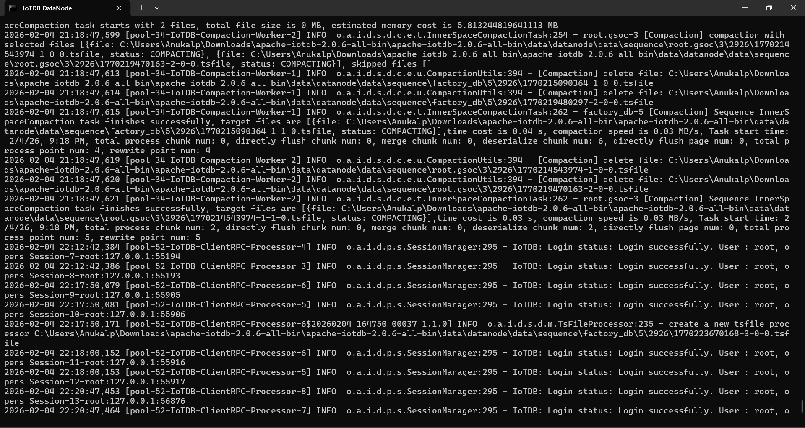
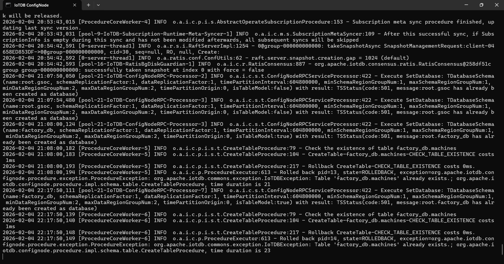
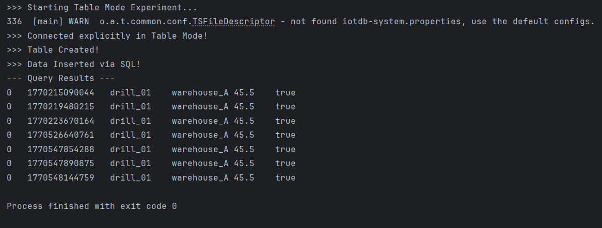
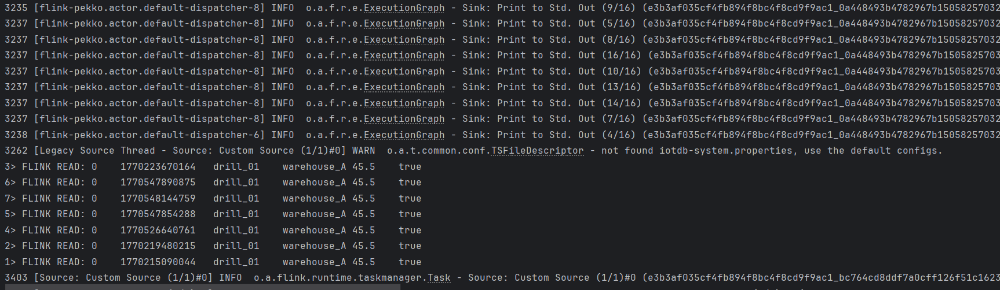

# Apache Flink + IoTDB 2.0 (Table Model) Connector

  

## Project Overview
This repository contains a functional prototype integrating **Apache Flink** with the new **Apache IoTDB 2.0 Table Model**.

Existing Flink-IoTDB connectors rely on the legacy **Tree Model** (`root.sg.d1`). With the release of IoTDB 2.0, a new **Table Model** was introduced to support standard SQL (`INSERT`, `SELECT`). This project demonstrates how to bridge Flink DataStreams with IoTDB's Table dialect, enabling SQL-based data ingestion and extraction.

## The Problem
The standard IoTDB `Session` API defaults to the Tree Model. Attempting to execute SQL queries (e.g., `CREATE TABLE`, `SELECT * FROM table`) using the legacy session results in syntax errors (e.g., `Expecting ROOT path`) because the dialect is incompatible.

## The Solution
This PoC implements a custom Flink `SourceFunction` that utilizes the **`TableSessionBuilder`**. This builder explicitly initializes the client-server handshake using the SQL dialect, allowing Flink to:
1.  Connect to IoTDB in **Table Mode**.
2.  Execute standard SQL queries (`SELECT * FROM machines`).
3.  Stream the `SessionDataSet` rows into the Flink processing engine.

## Code Structure

* **`src/main/java/FlinkIoTDBTableSource.java`**
    * The core implementation.
    * Implements Flink's `SourceFunction`.
    * Manages the `ITableSession` lifecycle.
    * Streams data from IoTDB to Flink.

* **`src/main/java/IoTDBDataGenerator.java`**
    * A utility script to initialize the Database and Table (`factory_db`, `machines`).
    * Inserts sample mock data to verify the read operation.

## How to Run

### Prerequisites
* **Apache IoTDB 2.0+**
* **Apache Flink 1.18** libraries
* **Java 8 or 11+**

### Step 1: Start IoTDB Server (Windows)

1.  Open **Command Prompt (cmd)**.
2.  Navigate to your IoTDB `sbin` folder:
    ```cmd
    cd C:\Users\.....................\apache-iotdb-2.0.6-all-bin\sbin\windows
    ```
3.  **Fix PowerShell Path (Important):**
    If your system cannot find PowerShell, run this command to temporarily set the path:
    ```cmd
    set PATH=%SYSTEMROOT%\System32\WindowsPowerShell\v1.0\;%PATH%
    ```
    *(This ensures the start script can locate PowerShell to launch the server.)*

4.  **Verify PowerShell:**
    Type `powershell` and press Enter. If it opens, type `exit` to return to cmd.

5.  **Start the Server:**
    Run the standalone script:
    ```cmd
    start-standalone.bat
    ```
    You should see: `Apache IoTDB 2.0+ (ConfigNode & DataNode running)`

### Step 2: Set up Java Project (IntelliJ IDEA)

1.  Open **IntelliJ IDEA**.
2.  Click **New Project**.
3.  Select **Maven** (on the left) and click **Create**.
4.  Name the project: `IoTDB_Table_Test`.
5.  **Add Libraries (pom.xml):**
    Open `pom.xml` and add the following dependencies inside the `<dependencies>` section:

    ```xml
    <dependencies>
        <dependency>
            <groupId>org.apache.iotdb</groupId>
            <artifactId>iotdb-session</artifactId>
            <version>2.0.1</version>
        </dependency>

        <dependency>
            <groupId>org.apache.flink</groupId>
            <artifactId>flink-streaming-java</artifactId>
            <version>1.18.0</version>
        </dependency>
        <dependency>
            <groupId>org.apache.flink</groupId>
            <artifactId>flink-clients</artifactId>
            <version>1.18.0</version>
        </dependency>
    </dependencies>
    ```

### Step 3: Run the Experiment

1.  **Generate Data:**
    Run `IoTDBDataGenerator.main()`. It will create the table `machines` and insert mock data.
    ```text
    >>> Connected explicitly in Table Mode!
    >>> Table Created!
    >>> Data Inserted via SQL!
    ```

2.  **Start Flink Job:**
    Run `FlinkIoTDBTableSource.main()`.
    Watch the console for the streamed output:
    ```text
    >>> Starting Flink Job...
    FLINK READ: 0	1770215090044	drill_01	warehouse_A	45.5	true
    ```

## Proof of Execution
Below is the execution log verifying the data flow from IoTDB Table Mode to Flink.




